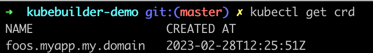
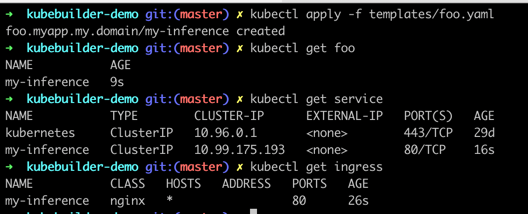

# kubebuilder-demo
🚀kubebuilder生成k8s-operator实战项目。

## 1.安装kubebuilder并且初始化项目
```shell
# download kubebuilder and install locally.
curl -L -o kubebuilder https://go.kubebuilder.io/dl/latest/$(go env GOOS)/$(go env GOARCH)
chmod +x kubebuilder && mv kubebuilder /usr/local/bin/

# create a project
kubebuilder init --domain my.domain

# create an API
kubebuilder create api --group myapp --version v1 --kind Foo

# modify your crd types  and create manifests
make manifests

# create custom resource definition
make install
```

```shell
# 查看对应的crd是否被创建
kubectl get crd
```


## 2. 本地运行
```shell
# 运行Manager
go run main.go
# 创建对应的foo
kubectl apply -f templates/foo.yaml
# 更改foo配置,deployment、service、ingress对应变更
kubectl edit foo my-inference
```


## 3. 增加webhook, 部署manager-controller
```shell
# create webhook codes
kubebuilder create webhook --group myapp --version v1 --kind Foo --defaulting  --programmatic-validation

# Implementing defaulting/validating webhooks and running controller with webhook in cluster
https://book.kubebuilder.io/cronjob-tutorial/webhook-implementation.html

# build image
make docker-build docker-push IMG=dongzhoujie2023/controller:latest

# deploy manager-controller
make deploy IMG=dongzhoujie2023/controller:latest
```

